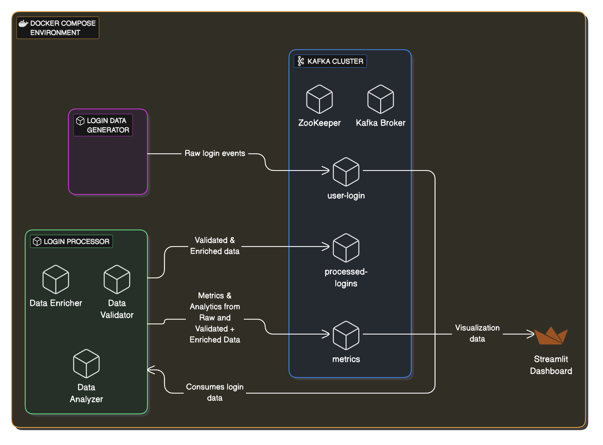
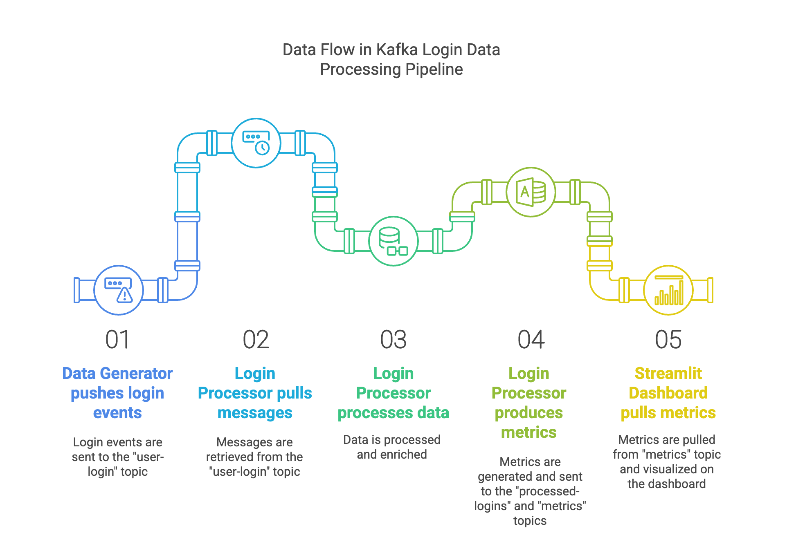

# Kafka Login Data Processing Pipeline

A real-time streaming data pipeline that processes user login events using Kafka and Docker.

## Project Overview

This project implements a real-time data processing pipeline that:

1. Consumes user login data from a Kafka topic
2. Validates and enriches the data
3. Analyzes patterns to extract insights
4. Produces the processed data to a new Kafka topic

The pipeline is implemented in Python and deployed using Docker and Docker Compose.

## Architecture



The system consists of the following components:

- **Zookeeper**: Coordinates the Kafka cluster
- **Kafka Broker**: Handles message queue management
- **Data Generator**: Produces sample login data to the input topic
- **Login Processor**: Consumes, processes, and enriches the login data
- **user-login topic**: Stores raw login data
- **processed-logins Topic**: Stores the processed data for downstream consumption
- **metrics Topic**: Stores the metrics of processed login data
- **Streamlit Dashboard**: Real-time visualization of insights and metrics

## Data Flow


## Prerequisites

- [Docker](https://www.docker.com/products/docker-desktop/) installed and running
- Git (to clone the repository)
- No Python knowledge required (everything runs in containers)

## Setup and Installation

1. Clone the repository:
   ```bash
   git clone git@github.com:kieDotson/kafka-login-processor.git
   cd kafka-login-processor
   ```

2. Start the Docker containers:
   ```bash
   docker compose up -d
   ```
   This command will:
   - Start Zookeeper and Kafka
   - Create the necessary Kafka topics
   - Start the data generator
   - Build and start the login processor
   - Start the Streamlit dashboard

3. Check that all containers are running:
   ```bash
   docker compose ps
   ```
   You should see all services in the "Up" state.

## Monitoring the Pipeline

### View the Streamlit Dashboard

Access the real-time dashboard by opening a browser and navigating to:
```
http://localhost:8501
```

This interactive dashboard provides:
- Real-time metrics on processed messages
- Visualizations of device types and app versions
- Geographic distribution of users
- Time-based activity patterns
- Recent messages and errors

### View Processor Logs

```bash
docker compose logs -f login-processor
```

This will show the processor's logs, including:
- Processing statistics
- Data insights
- Any validation errors

### View Streamlit Logs

```bash
docker compose logs -f streamlit-dashboard
```

This will show the processor's logs, including:
- Processing statistics
- Data insights
- Any validation errors


### Check Kafka Topics

List all topics:
```bash
docker compose exec kafka kafka-topics --bootstrap-server kafka:9092 --list
```

View messages in the input topic:
```bash
docker compose exec kafka kafka-console-consumer --bootstrap-server kafka:9092 --topic user-login --from-beginning --max-messages 5
```

View processed messages in the output topic:
```bash
docker compose exec kafka kafka-console-consumer --bootstrap-server kafka:9092 --topic processed-logins --from-beginning --max-messages 5
```

Check consumer group status:
```bash
docker compose exec kafka kafka-consumer-groups --bootstrap-server kafka:9092 --describe --group streamlit-dashboard
```

## Understanding the Data Processing

The login processor performs several operations on the incoming data:

### 1. Validation
The processor validates that each message:
- Contains all required fields
- Has proper data types and formats
- Contains valid values (e.g., timestamp, IP address)

### 2. Enrichment
The processor enriches the data by adding:
- Processing timestamp
- Human-readable time format
- Processing delay measurement
- Geographic region based on locale
- Day of week and hour of day
- App version components

### 3. Analytics
The processor tracks:
- Device type distribution
- Locale/region distribution
- App version distribution
- Peak usage times
- Error rates

### 4. Output

#### Processed Login Data
The enriched data is sent to the `processed-logins` topic with the following schema:

```json
{
  "user_id": "424cdd21-063a-43a7-b91b-7ca1a833afae",
  "app_version": "2.3.0",
  "device_type": "android",
  "ip": "199.172.111.135",
  "locale": "RU",
  "device_id": "593-47-5928",
  "timestamp": "1694479551",
  "processed_timestamp": 1694479700,
  "readable_login_time": "2023-09-12 15:32:31",
  "processing_delay_seconds": 149,
  "day_of_week": "Tuesday",
  "hour_of_day": 15,
  "region": "Europe/Asia",
  "app_version_major": 2,
  "app_version_minor": 3,
  "app_version_patch": 0
}
```

#### Metrics Data
In addition to the processed login data, the system sends metrics and analytics data to the metrics topic. The metrics data follows these structures:

##### Periodic Bulk Metrics Update (sent every 10 messages):

```json
{
  "device_counts": {
    "android": 45,
    "ios": 32,
    "web": 12
  },
  "locale_counts": {
    "US": 37,
    "RU": 18,
    "DE": 14,
    "GB": 12
  },
  "app_version_counts": {
    "2.3.0": 58,
    "2.2.1": 23,
    "2.4.0": 8
  },
  "hourly_activity": {
    "0": 5, "1": 3, "2": 2, "3": 1, "4": 0, "5": 2, 
    "6": 4, "7": 7, "8": 12, "9": 15, "10": 14, "11": 11,
    "12": 10, "13": 9, "14": 8, "15": 7, "16": 5, "17": 11, 
    "18": 14, "19": 13, "20": 16, "21": 10, "22": 8, "23": 7
  },
  "daily_activity": {
    "Monday": 45, "Tuesday": 52, "Wednesday": 48, "Thursday": 50,
    "Friday": 47, "Saturday": 38, "Sunday": 30
  },
  "processed_count": 310,
  "invalid_count": 12,
  "processing_time": 3.45,
  "recent_message": {/* complete message object */}
}
```

##### Individual Message Updates (sent for each message):

```json
{
  "recent_message": {/* complete processed message */},
  "processing_time": 2.76
}
```

##### Error Notifications (sent when validation fails):

```json
{
  "error": "<error_message>",
  "user_id": "<user_id>",
  "device_id": "593-47-5928",
  "timestamp": "1694479551"
}
```

These different types of metrics messages allow the dashboard to display real-time updates while also receiving comprehensive statistics periodically, providing both immediate responsiveness and detailed analytics.

## Development and Testing

If you want to modify or test the code, you'll need Python 3.9+ installed on your system.

### Setting Up a Development Environment

1. Install Python dependencies:
   ```bash
   pip3 install -r requirements.txt
   ```

2. Run the unit tests:
   ```bash
   python3 -m unittest discover tests
   ```

### Project Structure

```
kafka-login-processor/
├── docker-compose.yml       # Docker configuration
├── Dockerfile               # Container definition for processor
├── Dockerfile.streamlit     # Container definition for Streamlit dashboard
├── requirements.txt         # Python dependencies for processor
├── requirements-streamlit.txt # Python dependencies for Streamlit
├── src/                     # Source code directory
│   ├── consumer.py          # Kafka consumer implementation
│   ├── processor.py         # Data processing logic
│   └── streamlit_app.py     # Streamlit dashboard application
└── tests/                   # Test directory
    ├── test_consumer.py     # Consumer tests
    └── test_processor.py    # Processor tests
```

### Making Changes

If you modify the processor code:

1. Rebuild the Docker image:
   ```bash
   docker compose build login-processor
   ```

2. Restart the service:
   ```bash
   docker compose restart login-processor
   ```

If you modify the streamlit code:

1. Force rebuild the Streamlit image
     ```bash
    docker compose build --no-cache streamlit-dashboard
    ```

2. Restart the container
    ```bash
    docker compose up -d --force-recreate streamlit-dashboard
    ```

## Shutting Down

To stop all services:
```bash
docker compose down
```

## Troubleshooting

### Common Issues

1. **Kafka Connection Error**:
   - Ensure all containers are running: `docker compose ps`
   - Check Kafka logs: `docker compose logs kafka`
   - Verify network connectivity: `docker compose exec login-processor ping kafka`

2. **Missing or Invalid Data**:
   - Check processor logs for validation errors: `docker compose logs login-processor`
   - Verify the data generator is producing data: `docker compose logs my-python-producer`

3. **Performance Issues**:
   - Check processor CPU/memory usage: `docker stats`
   - Examine consumer lag: `docker compose exec kafka kafka-consumer-groups --bootstrap-server kafka:9092 --describe --group login-processor-group`

### Getting Help

If you encounter issues not covered here, please:
1. Check the logs of all services: `docker compose logs`
2. Contact the project maintainer(me)

## Design Choices and Tradeoffs

### Component-Based Architecture
The processor is designed using a component-based architecture with distinct classes for different responsibilities:

```
LoginDataProcessor
    ├── DataValidator   - Validates message schema and field values
    ├── DataEnricher    - Adds derived and computed fields to valid messages
    └── DataAnalyzer    - Tracks metrics and generates insights from the data
```

This design provides several benefits:
1. **Separation of Concerns**: Each component handles a specific aspect of data processing
2. **Improved Maintainability**: Changes to validation rules, enrichment logic, or analytics can be made independently
3. **Enhanced Testability**: Components can be tested in isolation with focused unit tests
4. **Code Reusability**: Components can be reused in other contexts or applications

The main processor orchestrates these components to create a complete data processing pipeline while keeping the codebase modular and extensible.

### Integrated Metrics Producer
The metrics producer is integrated directly into the LoginProcessor class rather than implemented as a separate service:

```
LoginProcessor
    └── metrics_producer  - Sends metrics directly to Kafka
```

This design choice provides several advantages:
1. **Direct Data Access**: The processor has immediate access to all metrics without additional inter-service communication
2. **Simplified Architecture**: Fewer services to manage and coordinate
3. **Reduced Latency**: Metrics are sent directly from where they're generated
4. **Cohesive Design**: Metrics generation is closely related to data processing

The alternative approach of creating a separate metrics service would offer stronger separation of concerns and independent scaling, but would add complexity and latency that isn't warranted for the current requirements. In a larger production system with more complex metrics needs, separating these concerns might become beneficial. 

*Inspiration came from  [kakfa streams core concepts documentation](https://kafka.apache.org/39/documentation/streams/core-concepts)

### Metrics Timing Strategy
The system implements a dual approach to metrics reporting:

1. **Periodic Bulk Metrics (every 10 messages)**: Comprehensive metrics and analytics are sent every 10 valid messages processed, including:
   - Device type distribution
   - Locale/region statistics
   - App version information 
   - Activity patterns
   - Performance metrics

2. **Per-Message Updates**: Each processed message is sent immediately to provide:
   - Real-time visibility into the latest data
   - Timely updates to the "recent messages" view
   - Immediate error reporting

This dual approach balances efficiency (reducing Kafka message volume by batching bulk metrics) with responsiveness (ensuring the dashboard always shows the most recent activity).

### Metrics Flow Architecture
The project uses Kafka as an intermediary for transmitting metrics between the processor and the Streamlit dashboard:

```
Login Processor → Kafka (metrics topic) → Streamlit Dashboard
```

This decoupled approach provides several important benefits:

1. **Separation of Concerns**: The processor focuses on data processing while the dashboard focuses on visualization, with clear boundaries between components.

2. **Independent Scaling**: Each component can be scaled independently, allowing for multiple processor instances all sending to the same metrics topic.

3. **Reliability**: If the dashboard crashes or is restarted, no metrics are lost as they're stored in Kafka until consumed. The processor continues functioning even if the dashboard is unavailable.

4. **Flexibility**: Other applications could consume from the metrics topic, and we could add more dashboards without modifying the processor.

5. **Data Buffering**: Kafka acts as a buffer during processing spikes, allowing the dashboard to consume metrics at its own pace.

The alternative direct connection approach (Processor → Streamlit) would require implementing APIs or websockets within Streamlit and adding complex error handling for connectivity issues in the processor.

### Efficiency
- Manual offset committing ensures at-least-once processing
- JSON serialization for readability and compatibility
- Comprehensive error handling prevents message loss

### Scalability
- Containerized deployment for easy horizontal scaling
- Stateless processing allows multiple instances
- Kafka consumer groups enable parallel processing

### Fault Tolerance
- Docker restart policies handle temporary failures
- Detailed error logging for troubleshooting
- Strict validation prevents corrupted data propagation

## Followup Questions

### 1. How Would You Deploy This Application in Production?
For a production deployment, I would recommend a Kubernetes-based approach with specialized operators for Kafka management:

#### Infrastructure Setup

- Cloud Provider: AWS, GCP, or Azure with managed Kubernetes (EKS, GKE, or AKS)
- Kafka Management: Use the Strimzi (or Stackable) Kubernetes Operator to manage Kafka in a cloud-native way
- Containerization: Package all components using Docker with proper tagging for version control
- Orchestration: Deploy on Kubernetes for robust container management

##### Strimzi Kafka Operator Benefits

- Declarative Kafka Configuration: Define your entire Kafka cluster as Kubernetes custom resources
- Automated Operations: Handle rolling updates, broker scaling, and certificate management
- Resource Optimization: Better resource utilization through proper Kubernetes scheduling
- Enhanced Monitoring: Built-in Prometheus metrics and Cruise Control for cluster balancing

#### Deployment Strategy

- GitOps Workflow: Use ArgoCD or Flux for declarative deployments
- CI/CD Pipeline: Implement with GitHub Actions or Jenkins
    - Automated testing before deployment
    - Image vulnerability scanning
    - Progressive delivery (canary or blue/green deployments)
- Infrastructure as Code: Define all resources using Terraform or similar

#### Networking & Security

- Network Policies: Restrict communication between components
- TLS Encryption: For all Kafka connections and service communication
- Authentication: Implement SASL for Kafka and OAuth2/OIDC for dashboard access
- Private Subnets: Deploy processing components in private networks

### 2. What Other Components Would You Add to Make This Production Ready?
#### Kafka Management with Strimzi

- Topic Operator: Automatic topic management through Kubernetes custom resources
- User Operator: Manage Kafka users and access controls as Kubernetes resources
- Cruise Control: For automated cluster balancing and scaling
- Kafka Connect Operator: Manage connectors through Kubernetes for integration with external systems

#### Observability Stack

- Metrics Collection: Utilize Strimzi's built-in Prometheus metrics exposure
- Custom Dashboards: Pre-built Grafana dashboards for Kafka monitoring
- Logging: ELK or Loki for centralized log collection and analysis
- Tracing: Jaeger or OpenTelemetry for distributed tracing
- Alerting: AlertManager with configured alerts for Kafka-specific metrics

#### Data Management

- Schema Registry: Deploy using Strimzi's schema registry operator
- Data Quality Service: Great Expectations for data validation
- Dead Letter Queue: Configured through Kafka Connect for failed messages
- Mirror Maker 2: For multi-datacenter replication, managed through Strimzi
- Data retention policies

#### Security Enhancements

- Secrets Management: Leverage Kubernetes secrets integrated with Strimzi
- TLS Management: Automatic certificate generation and rotation through Strimzi
- Authorization: Kafka ACLs managed as Kubernetes custom resources
- RBAC: Role-based access controls for all Kubernetes resources

Note: The need for all of these components still stands without Strimzi or any other specific tools mentioned. The tools used depends on business requirements, compliane requirements, budget, and the existing tech stack(if one exsists).

### 3. How Can This Application Scale with a Growing Dataset?
#### Horizontal Scaling with Strimzi

- Declarative Scaling: Scale Kafka brokers by updating the replicas field in the Kafka custom resource
- Automated Balancing: Leverage Cruise Control to rebalance data automatically when scaling
- Zone Awareness: Configure Strimzi for multi-zone deployment to ensure availability
- Topic Scaling: Dynamically adjust partitions through the Topic Operator

#### Performance Optimizations

- Resource Tuning: Fine-tune JVM and Kafka parameters via Strimzi configuration
- Broker Sizing: Properly size brokers based on workload characteristics
- Affinity Rules: Configure pod affinity for optimal data locality
- Storage Classes: Use appropriate storage classes for Kafka's I/O patterns

#### Infrastructure Scaling

- Auto-scaling Consumer Groups: Deploy processor pods with Horizontal Pod Autoscaling
- Resource Requests/Limits: Properly configured for predictable performance
- Node Pools: Dedicated node pools for Kafka brokers with optimized instances
- Priority Classes: Ensure critical components get resource priority

#### Monitoring and Adaptation

- Metric-Based Scaling: Configure HPA based on consumer lag metrics
- Trend Analysis: Monitor growth patterns to predict scaling needs
- Consumption Rate Alerts: Set up alerts for unexpected consumption patterns
- Capacity Planning: Regular review of resource utilization and performance metrics

By leveraging Strimzi's Kubernetes-native approach, the system becomes much more adaptable to changing workloads, with scaling operations that can be automated and managed through the same GitOps workflow as the rest of the application. This creates a more cohesive, manageable, and resilient production environment.


#### Kafka Streams API Consideration

For future development, migrating to the Kafka Streams API would provide several advantages:

- **Stateful Processing**: Maintain state across messages for complex analytics
- **Time Windows**: Implement time-based aggregations (hourly, daily summaries)
- **Exactly-Once Semantics**: Ensure data is processed exactly once even during failures
- **Stream Joins**: Combine data from multiple topics for enriched analytics
- **Automatic Scaling**: Distribute processing across multiple instances with automatic partitioning

The current implementation uses standard Kafka consumers/producers for simplicity and transparency, making the code more approachable while satisfying the immediate requirements. However, as the system grows in complexity, the Streams API would provide more powerful abstractions for stream processing.
